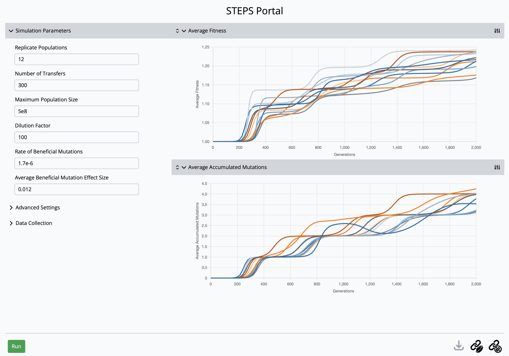

# Contributing to STEPS

Thank you for your interest in contributing to STEPS. We welcome community contributions to improve the project.

If you plan to introduce new scientific features, please contact Richard Lenski via email at Lenski@msu.edu to discuss the proposed features. For changes that are primarily technical in nature, we recommend opening a GitHub issue and tagging @zachmatson to discuss the changes ahead of time. However, for small improvements, feel free to open a pull request directly.

## Prerequisites

- [Rust and Cargo](https://www.rust-lang.org/tools/install) (installed via rustup)

## Building

```bash
cargo build --release
```

For native CPU optimizations:

```bash
RUSTFLAGS="-C target-cpu=native" cargo build --release
```

## Running Tests

```bash
cargo test
```

This package includes integration tests that verify the exact numerical results for a specific seed and set of parameters. If you make changes that affect the stochastic events simulated in STEPS (mutation, dilution), then these tests may no longer pass. In that case, you will have to update the expected output values of the integration tests. Please call out any such intentional changes to the numerical outputs when opening your pull request.

Even if you change the exact numerical outputs, you should still be able to produce qualitatively similar results to Figure 3 of the JOSS paper for this project by running simulations in the web portal with default settings.



## Running Auto-Formatting

```bash
cargo fmt
```

## Submitting Changes

1. Fork the repository
2. Create a branch for your change
3. Make your changes and ensure tests pass
4. Open a pull request against `main`

## License

By contributing, you agree that your contributions will be licensed under the [GPL-3.0 License](LICENSE).

## AI Usage

AI tools may be used when contributing to STEPS. However, you must:

- Disclose in your pull request that AI development tools were used.
- Ensure that, however your code was developed, you have all necessary rights to contribute it under the [GPL-3.0 License](LICENSE).
- Take responsibility for all changes being made, including the specific code that you are contributing. STEPS is a "non-slop" codebase, regardless of how your code was developed.
